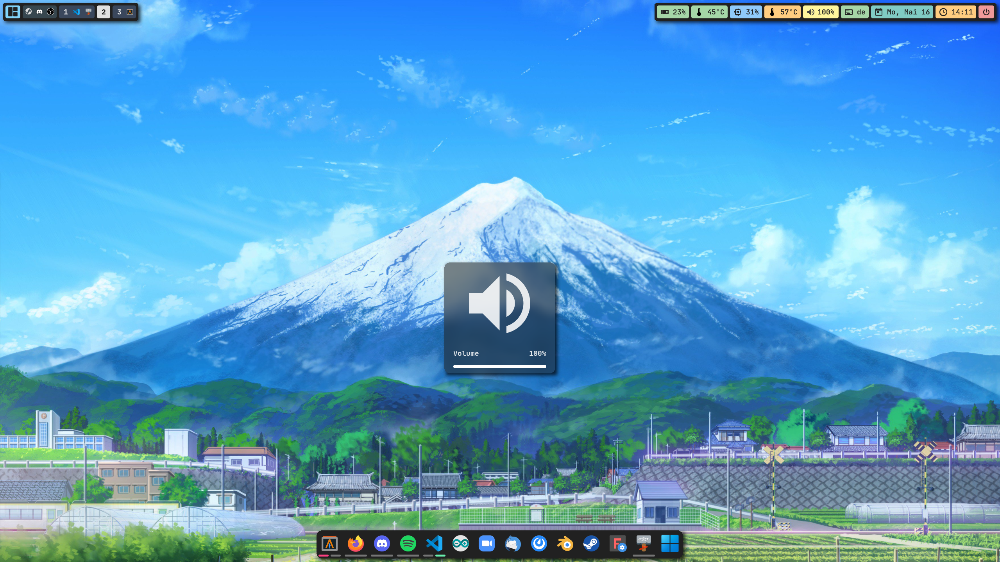
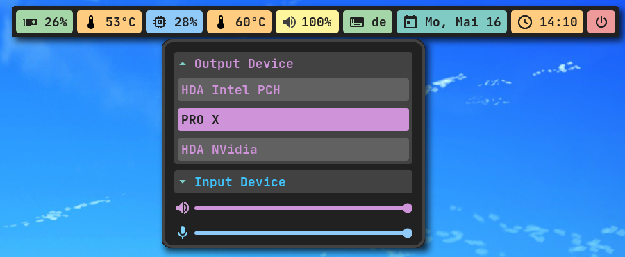
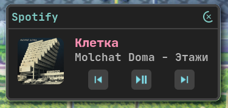

<div align="center">
    <h1>Crylia Theme</h1>
</div>

---


---

<div align="center">
    <h1>Welcome to my dotfiles</h1>
</div>
<div align="center">

An AwesomeWM theme inspired by everything I could find online and thought "Hey, that looks good!".

This repository holds mainly my AwesomeWM theme but also some other rice's I've done over the years.

Everything you see is done purely because I hate myself and like to give myself a hard time.
</div>


## Information

---
<image align="right" width="450px" src="assets/neofetch.png"/>

**My system setup**:

- **OS**: [Pop!_OS](https://pop.system76.com/)
- **WM**: [AwesomeWM](https://github.com/awesomeWM/awesome)
- **Terminal**: [Alacritty](https://github.com/alacritty/alacritty)
- **Shell**: [ZSH](https://github.com/ohmyzsh/ohmyzsh)
- **Compositor**: [Picom](https://github.com/jonaburg/picom)
- **Application Launcher**: [Rofi](https://github.com/davatorium/rofi)
- **File Manager**: [Thunar](https://github.com/xfce-mirror/thunar)
- **Icons**: [Papirus-Dark](https://github.com/PapirusDevelopmentTeam/papirus-icon-theme)
- **Cursor**: [Vimix-Cursors](https://github.com/vinceliuice/Vimix-cursors)
- **Font**: [JetBrainsMonoNerdFont](https://www.nerdfonts.com/font-downloads)
- **Editor**: [VS Code](https://code.visualstudio.com/)


## Installation

---

#### Here are three levels of what you need

1. Dependencies you need to have in order for the rice to work
2. Important dependencies but can be replaced, the theme might behave weird without these or without proper reconfiguration!
3. Nice to have and are the default. Can be easily changed without any worries!

#### Using the install script (Thanks to @JulianGR)

>**Arch**

```bash
git clone https://github.com/Crylia/crylia-theme
cd crylia-theme
chmod +x autoinstall_arch.sh
./autoinstall_arch.sh
```

>**Pop!_OS/Ubuntu**

```bash
git clone https://github.com/Crylia/crylia-theme
cd crylia-theme
chmod +x autoinstall_pop_os.sh
./autoinstall_pop_os.sh
```

<details>
<summary><b>1. Dependencies</b></summary>

#### **AwesomeWM**

>**Arch**

```bash
yay -S awesome-git
```

> **Ubuntu**

```bash
sudo apt build-dep awesome
git clone https://github.com/awesomeWM/awesome.git
make package
sudo dpkg -i awesome*.deb
```

#### **Rofi**

>**Arch**

```bash
yay -S rofi-git
```

>**Ubuntu**

Check [HERE](https://github.com/davatorium/rofi/blob/next/INSTALL.md) for how to build from source. Note **DO NOT INSTAL ROFI FROM APT IT WONT WORK**

#### **Picom**

> **Arch**

```bash
yay -S picom-jonaburg-git
```

> **Ubuntu**

```bash
git clone https://github.com/jonaburg/picom
cd picom
meson --buildtype=release . build
sudo ninja -C build install
```

#### **nvidia-smi**

> **Ubuntu**

```bash
sudo apt install nvidia-smi
```

</details>
<details>

<br>

<summary><b>2. Important Dependencies</b></summary>

#### **Papirus** - Icon Theme

***Make sure the theme is located at `/usr/share/icons/`***

> **Arch**

```bash
sudo pacman -S papirus-icon-theme
```

> **Ubuntu**

```bash
sudo apt install papirus-icon-theme
```

#### **pactl - PulseAudio Controler**

***All audio scripts depends on this***

> **Arch**

```bash
sudo pacman -S pulseaudio-alsa
```

> **Ubuntu**

```bash
sudo apt install pulseaudio-utils
```

#### **upower - Battery Info**

> **Arch**

```bash
sudo pacman -S upower
```

> **Ubuntu**

```bash
sudo apt install upower
```

#### **bluez/bluetoothctl - Bluetooth**

> **Arch**

```bash
sudo pacman -S bluez bluez-utils
```

> **Ubuntu**

```bash
sudo apt install bluez bluez-utils
```

#### **setxkbmap - Change Keyboard Layout**

> **Arch**

```bash
sudo pacman -S xorg-setxkbmap
```

> **Ubuntu**

```bash
sudo apt install xorg
```

#### **xfce4-power-manager - Backlight**

> **Arch**

```bash
sudo pacman -S xfce4-power-manager
```

> **Ubuntu**

```bash
sudo apt install xfce4-power-manager
```

#### **playerctl - Media control**

> **Arch**

```bash
sudo pacman -S playerctl
```

> **Ubuntu**

```bash
sudo apt install playerctl
```

#### **LightDM - Login/Logout/ScreenLock**

> **Arch**

```bash
sudo pacman -S lightdm light-locker
```

> **Ubuntu**

```bash
sudo apt install lightdm light-locker
```

#### **MesloLGS NF Font**

> **Arch**

```bash
sudo pacman -S ttf-meslo-nerd-font-powerlevel10k
```

> **Ubuntu**

```bash
wget https://github.com/romkatv/powerlevel10k-media/raw/master/MesloLGS%20NF%20Regular.ttf 
wget https://github.com/romkatv/powerlevel10k-media/raw/master/MesloLGS%20NF%20Bold.ttf
wget https://github.com/romkatv/powerlevel10k-media/raw/master/MesloLGS%20NF%20Italic.ttf
wget https://github.com/romkatv/powerlevel10k-media/raw/master/MesloLGS%20NF%20Bold%20Italic.ttf
```

</details>

<details>
<summary><b>3. Optional Dependencies</b></summary>

#### **Alacritty** - Default terminal

> **Arch**

```bash
sudo pacman -S alacritty
```

> **Ubuntu**

```bash
sudo apt install alacritty
```

#### **Thunar** - Default file manager

> **Arch**

```bash
sudo pacman -S thunar
```

> **Ubuntu**

```bash
sudo apt install thunar
```

#### **Flameshot - Screenshots**

> **Arch**

```bash
sudo pacman -S flameshot
```

> **Ubuntu**

```bash
sudo apt install flameshot
```

</details>

#### Setup

Make sure to backup any data before you copy my theme over!

```bash
git clone https://github.com/Crylia/crylia-theme
cd crylia-theme
cp -r awesome ~/.config/.
cp -r picom.conf ~/.config/.
cp -r rofi ~/.config/.
```

Optional

```bash
cp -r alacritty ~/.config/.
```

## [Documentation | Wiki | FAQ](https://github.com/Crylia/crylia-theme/wiki/Documentation)

## Features

---

#### Some notable features

- [x] Multi screen support
- [x] Interactive task/taglist and dock (left, right click and hover over)
- [x] Session option to reboot, shutdown etc
- [x] Multi keyboard layout support + switch widget
- [x] Rofi application launcher and window switcher
- [x] Volume / Brightness control widget
- [X] Configurable Dock
- [x] Systray
- [x] GPU/CPU/RAM Temperature, Usage and Clock widget
- [x] Full audio device selector
- [x] Easy to configure dots
- [x] Interactive notifications

#### Some stuff planned for the future

- [ ] Calendar OSD
- [ ] More bugs
- [ ] I3 like layout / manual tiling

<br>

There are many widgets to choose from

**Widget List**:

- Battery
- Network (Wifi, Ethernet)
- Bluetooth
- Volume
- Keyboardlayout
- Date
- Time
- Session options
- Taglist
- Tasklist
- Layoutswitcher
- GPU/CPU/RAM Temperature/Usage and Clock speed.

## Gallery

---
>
>
>Entire Desktop with two terminal open

>
>
>Lockscreen

>
>
>Volume OSD (Backlight looks similar)

>
>
>Switch In/Output devices easily

>
>
>Spotify example notification with working media control

>
>
>Top Left bar closeup

>
>
>Top Center bar closeup

>
>
>Top Right bar closeup

>
>
>Dock closeup

## Known bugs

---

### Please note, the config could easily break since I can only test it on so many systems. Every installation is different

### __If you encounter any bug or question you can't solve, feel free to open a new issue or PR__

- The dock may not work with most flatpaks, snaps, appimages and Icons wont work when a path instead of a program is specified
- The Volume and Backlight keys will be really laggy when changed too fast
- Not every program will use the Icon's pack icon in the taglist and tasklist
- The Volume OSD wont go over 100% even if the volume is higher(the regular widget works)
